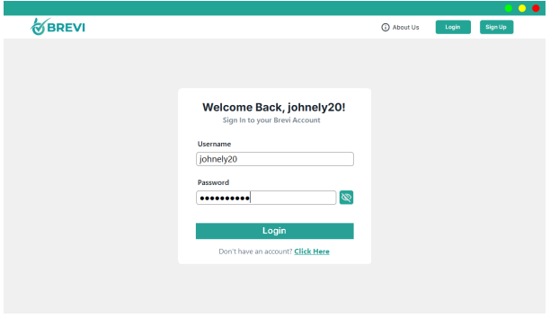
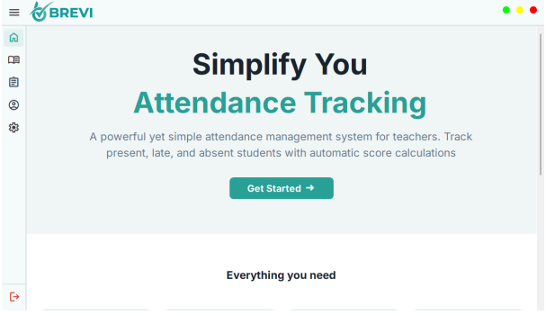
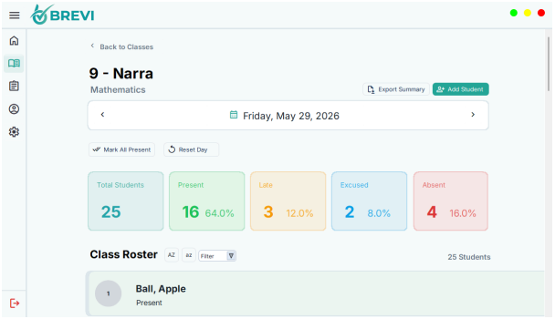

# BREVI: Attendance Management System

This project aims to help teachers - specifically Highschool and Senior Highschool ones - lessen their time on taking attendance manually using excel by providing them with a more better solution. Using this app, you can create sections, custom subjects, add students, filter them by attendance status, easily jump to specific dates, and most importantly take attendance.

## Features

- Attendance Features
- Fullscreen mode
- Date Jumping

## Usage/Examples

### 🖥️ Project Screenshots

1. Interaction Page
When the user opens the Brevi application, the Interaction Page is the first screen that appears. This page serves as the welcome interface of the system and provides users with options to either log in or create a new account. The user can read a short introduction about the application and select the appropriate button depending on whether they already have an account or are new to the system. This page acts as the starting point for accessing all features of Brevi.

2. Login
If the user already has an account, they may click the Login button on the Interaction Page. The Login Page allows the user to enter their registered username and password to access the application securely. Once the correct credentials are entered, the system verifies the account information and redirects the user to the Homepage. This process ensures that only authorized users can use the attendance management features of the application.

3. Sign Up
If the user does not yet have an account, they may select the Sign Up option from the Interaction Page. The Sign Up Page allows users to create a new account by entering the required information such as username, password, and other account details. After successfully completing the registration process, the user can log in using their newly created account credentials. This feature allows new users to gain access to the system quickly and efficiently.

4. Homepage
After logging in successfully, the user is directed to the Homepage, which serves as the main dashboard of the Brevi application. The Homepage provides navigation options to different sections of the system such as Classes, Attendance Records, Teacher Profile, and Settings. It also contains options for logging out or exiting the application. From this page, users can easily access the core features and manage attendance-related tasks efficiently.

5. Classes Page
When the user navigates to the Classes Page, they can manage all recorded classes within the system. The page allows users to add new classes, remove existing classes, or view previously created class records. Each class entry helps organize students and attendance data properly. This page serves as the main section for handling classroom organization and subject management.

6. Attendance Page
When the user selects a specific class from the Classes Page, the system opens the Attendance Page for that selected class. On this page, users can add or remove students from the class list and record attendance for each student. The system allows attendance statuses such as Present, Late, Absent, or Excused to be assigned easily. This page helps teachers monitor student participation and maintain accurate attendance records efficiently. 

7. Records Page
If the user returns to the Homepage, they may access the Records Page through the navigation menu. This page displays all attendance records and class data stored within the application. Users can choose to archive a specific class if it is no longer active while still preserving its records. Archived classes can also be restored back to the current list whenever needed. This feature helps users organize records while maintaining access to important attendance information.

8. Teacher Page
The Teacher Page displays the personal and professional information of the logged-in user. On this page, users can view, edit, or update their account details and profile information. This may include changing profile data, adding additional information, or updating account-related settings. The page ensures that teacher records remain accurate and properly maintained within the system.

9. Settings Page
The Settings Page allows users to customize and manage important system configurations within the Brevi application. Users can update their account username and password to maintain account security. The page also provides options for editing the attendance grading formula for categories such as Present, Late, Absent, and Excused. This feature gives users flexibility in adjusting attendance calculations according to their preferred grading or attendance policies.

## Installation

Go to https://zedpetero.github.io/Brevi-Installer/Publish.html to download the setup file. Once you have downloaded the file, click it to install the application. Wait for a few seconds then Click Yes when asked to download .Net10 runtime. Once you have downloaded the .Net10 runtime a black command prompt screen will appear, just let it be because it is intalling the required fonts for the User Interface. Then once it is done, close the application first to reset it. Happy Using! 
## Authors

- [@Brent Balansag](https://github.com/bbalansag557668-del)
- [@John Balbero](https://www.github.com/jbalbero553703)
- [@Pete Petero](https://www.github.com/ZedPetero)

